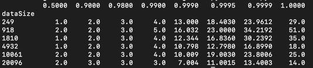

# Getting Started

### Reference Documentation

For further reference, please consider the following sections:

* [Official Apache Maven documentation](https://maven.apache.org/guides/index.html)
* [Spring Boot Maven Plugin Reference Guide](https://docs.spring.io/spring-boot/docs/3.2.1/maven-plugin/reference/html/)
* [Create an OCI image](https://docs.spring.io/spring-boot/docs/3.2.1/maven-plugin/reference/html/#build-image)

### 项目环境

* JDK 17
* spring-boot 3.2.1
* netty
* 多线程

### 项目说明

* 测试数据使用protobuf编码压缩
* 使用netty启动tcp服务端并使用PB协议

### 配置说明

* [重要]() 下载好项目后配置jdk17环境
* [重要]() 配置后先执行clean，然后执行maven Plugins中的 protoc-jar:run生成pb文件
* [重要]() 配置src/main/generated-sources目录为Generated Sources Root

### 业务文档

本项目用于测试TCP客户端与服务端通信的效率，主要包含以下功能：

* 客户端上线事件: 客户端上线后向tcp 服务端发送一个上线事件
* 心跳事件: 客户端每隔5秒向tcp 服务端发送一个心跳ping事件，服务端收到后给客户端回一个心跳pong事件，服务端根据ping事件续期客户端的存活状态
* 时间差校准: 服务端每秒向tcp 客户端发送一个时间校准消息，客户端收到后给服务端回一个客户端时间，服务端根据传输时间及客户端与服务端的时间戳来估算客户端与服务端的时间差
* 测试数据发送：服务端在客户端上线后，开始按照配置向客户端发送测试数据，直至测试结束或客户端下线
* 测试数据结果处理：客户端收到服务端发送的测试数据后，向服务端反馈接收时间，服务端根据客户端返回的时间和发送时间以及时间差信息计算出测试数据的传输时间

### 业务流程技术说明

* 系统启动时，加载配置信息[application.yml](src%2Fmain%2Fresources%2Fapplication.yml)
*
系统启动后在使用[TcpServerBootstrap.java](src%2Fmain%2Fjava%2Fnet%2Fitfeng%2Fnettytcpdemoserver%2Fserver%2FTcpServerBootstrap.java)
启动netty tcp 服务
* 系统启动后运行定时任务，发送校准消息ClientTimeDiffCalculator#sendTimeDiffMessage，发送心跳消息ClientHeartBeatCalculator#sendTimeDiff
* 系统启动后运行定时任务，发送测试数据TestDataTransService#run，执行发送测试数据的逻辑
    * 定时任务每3秒运行一次，监控到有客户端上线，则创建一个独立的发送数据线程向客户端发送数据。
    * 发送数据的大小、发送的次数、发送频率 根据配置文件[application.yml](src%2Fmain%2Fresources%2Fapplication.yml)中的配置决定

### 数据分析说明

*
测试结果数据会写入到文件/tmp/applog/TestDataTrans.log，配置详情见[logback-spring.xml](src%2Fmain%2Fresources%2Flogback-spring.xml)
* 运行 [data_analysis.py](script%2Fdata_analysis.py) 可以得到如下结果
  